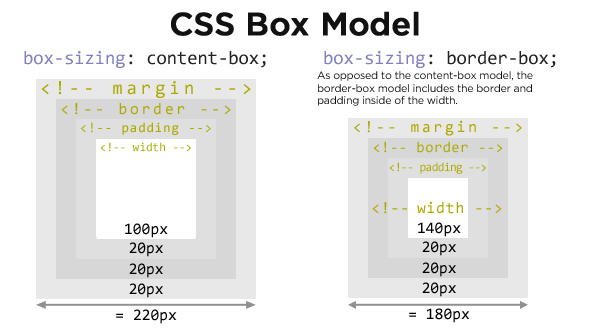

# CSS Basics

---

# Cascading Style Sheets

- A set of rules to describe how content on a web page should look
- Proposed in 1994
- Many different ideas from different browsers came together
- First browser to implement CSS was Internet Explorer 3 in 1996
- It is still changing and being updated!

---

# Styling

CSS lets you write style rules that apply to individual elements, a group of elements, or a category of elements.

These rules are associated with html elements by means of **selectors** and are expressed in a **declaration**, made up of a **property** and a **value**.

---


---

# CSS Syntax

```css
selector {
  property: value;
}
```

- Always start with a selector, then curly braces.
- You can have multiple property-value pairs inside the braces.
- You cannot nest braces.

---

# Selectors

```css
// selects all h1 elements
h1 {
  font-size: 2rem;
}

// selects all h1 and h2 elements
h1,
h2 {
  color: #FFFFFF;
}

// selects all elements with the class "selfie"
.selfie {
  border: 4px solid #000000;
}

// selects all <a> elements nested inside elements with the class "sidebar"
.sidebar a {
  color: #FF0000;
}

// selects all elements (universal selector)
* {
  margin: 0;
}
```

---

# Types of selectors

- elements (`h1`)
- classes (`.sidebar`)
- ids (`#main-menu`)
- attributes (`[lang=es]`)
- pseudo-classes (`:hover`, `:required`)
- pseudo-elements (`a::before`)
- combinations (`.sidebar a`, `ul > li`, `img + caption`)

[MDN CSS Selectors Reference](https://developer.mozilla.org/en-US/docs/Web/CSS/CSS_Selectors)

---

# Exercise: CSS Diner

[Play with css selectors at the CSS Diner](https://flukeout.github.io/)

---

## Prefer classes as selectors

Each selector has a _specificity_. It's hard to remember specificity rules and apply them accurately.

Class selectors are _more specific_ than element selectors and so are more likely to give you the results you have in mind.

Pseudo-classes are also useful (e.g. `:hover`)

[Read about specificity on MDN](https://developer.mozilla.org/en-US/docs/Learn/CSS/Building_blocks/Cascade_and_inheritance#Specificity)

---

# CSS Properties

We use **properties** to set the style of selected elements.

```css
.selfie {
  border-color: black;
  border-width: 1px;
  border-style: solid;
  padding: 3px;
}
```

Notice the semicolons at the end of each line.

---

# Text and Font Properties

- `color`: the color of the text
- `font-size`: the size of the text, in pixels (`px`) or other units
- `font-family`: the name of the font; can include alternates
- `font-weight`: `normal`, `bold`; can be a numeric value.
- `text-decoration`: `none`, `underline`; used often with `a` elements
- `text-align`: `left`, `right`, `center`, `justify`
- `line-height`: value multiplied by font size (usually) to change vertical space

---

# Colors

There is a giant list of color names you can use, but you will generally use a **hex code**.

A **hex code** is a set of three numbers ranging from 0 to 255 in hexadecimal (base-16) format. It begins with a pound sign: `#FF00A7`.

The first number is the amount of red.
The second number is the amount of green.
The third number is the amount of blue.

`#000000` is black.
`#FFFFFF` is white.

See [HTML Color Codes](https://htmlcolorcodes.com/)

---

# Color with RGB and RGBa

Specified with a comma-separated list of three values ranging from 0 to 255 or percentage values from 0% to 100%.

The values represent red, green, and blue.

`rgb(0, 255, 255)`

RGBa adds a fourth value that represents the opacity of the color ranging from 0.0 (totally transparent) to 1 (totally opaque).

The values indicate red, green, blue, and alpha.

`rgba(0, 255, 255, 0.5)`

---

# Color with HSL and HSLa

Specified with a comma-separated list of three values:

`hsl(180, 100%, 50%);`

- Hue (a number ranging from 0 to 360)
- Saturation (a percentage ranging from 0% to 100%) and a
- Lightness (a percentageranging from 0% to 100%).

HSLa adds a fourth value that indicates opacity, ranging from 0.0 (totally transparent) to 1 (totally opaque):

`hsla(180, 100%, 50%, 0.5)`

[More detail on color values at MDN](https://developer.mozilla.org/en-US/docs/Web/CSS/color_value)

---

# Block properties

- `background-color`
- `padding`: space inside the box
- `margin`: space outside the box
- `border-width`: size of the border
- `border-color`: color of the border
- `border-style`: `none`, `dotted`, `dashed`, `solid`, `double`
- `border-radius`: round corners
- `width`: total width of the box, in `px`, `em`, `rem`, or percentage

---

# The Box Model


---

# Margin and Padding

You can specify the margin and padding in multiple ways:

1. one value for all sides
2. one value for the top and bottom and a second value for the right and left sides
3. one value for each side in a clockwise order starting at the top: top, right, bottom, left

---

```css
margin: 5px; /* all sides */
margin: 5px 10px; /* top & bottom, left & right*/
margin: 5px 10px 10px 20px; /* top, right, bottom, left */
```

---

# Shorthand Properties

CSS defines several properties that group related sub-properties, letting you set multiple values in one line.

For example, `margin` includes:

`margin-top`
`margin-bottom`
`margin-left`
`margin-right`

These sub-properties are also valid properties that can be used individually:

```css
.price-total {
  margin-top: 10px;
}
```

[MDN Shorthand Properties](https://developer.mozilla.org/en-US/docs/Web/CSS/Shorthand_properties)

---

# Units of measure

- **`px`**: pixels; an _absolute_ unit
- **`em`**: a number multiplied by the element's font-size (this can keep multiplying as elements that inherit the parent's size are nested, so be careful!)
- **`rem`**: relative to the root element's font-size (this will not keep multiplying)
- **`%`**: percentage relative to the parent element
- **`vh` / `vw`**: viewport height / width, used with number that represents a percentage
- **`0`**: never needs a unit

[MDN CSS Values and Units](https://developer.mozilla.org/en-US/docs/Learn/CSS/Building_blocks/Values_and_units)

---

# A box with rounded corners and a border

```css
.likes {
  background-color: blue;
  border-color: black;
  border-radius: 10px;
  border-style: solid;
  border-width: 1px;
  color: white;
  margin: 10px 0;
  padding: 5px 10px;
}
```

---

# `box-sizing`



---

# use border-box

```css
* {
  box-sizing: border-box;
  margin: 0;
  padding: 0;
}
```

---

# CSS Backgrounds

shorthand property:

```css
body {
  background: url('background.jpg') /* image */ top center / 200px 200px
    /* position / size */ no-repeat /* repeat style */ red; /* color */
}
```

---

### `background` defines all of the following:

- `background-image`
- `background-position`
- `background-size`
- `background-repeat`
- `background-color`

and, somewhat less commonly:

- `background-attachment`
- `background-origin`
- `background-clip`

[MDN CSS background](https://developer.mozilla.org/en-US/docs/Web/CSS/background)

---

# `background-image`

Background images can be set to an image file or a gradient.

```css
background-image: url('pattern.jpg');
background-image: linear-gradient(rgba(255, 255, 0, 0.5), rgba(0, 0, 255, 0.5));
background-image: radial-gradient(red, blue);
background-image: repeating-radial-gradient(
  circle at center,
  red 0,
  blue,
  green 30px
);
```

[MDN background-image](https://developer.mozilla.org/en-US/docs/Web/CSS/background-image)

---

# `background-position`

This property takes a value that is a set of X and Y coordinates.
They can be units of measure, or `center`, `top`, `bottom`, and `right`.

```css
background-position: 25% 75%;
background-position: top left;
background-position: 10px 20px;
background-position: bottom 10px right 10px; /* offset */
```

[MDN background-position](https://developer.mozilla.org/en-US/docs/Web/CSS/background-position)

---

# `background-repeat`

```css
background-repeat: repeat no-repeat;
background-repeat: repeat-x;
background-repeat: no-repeat repeat;
background-repeat: repeat-y;
background-repeat: repeat repeat;
background-repeat: space;
```

[MDN background-repeat](https://developer.mozilla.org/en-US/docs/Web/CSS/background-repeat)

---

# `background-size`

This property also takes X and Y values, but there are two special ones you'll see often:

- `contain`: make the image as large as possible while ensuring that it stays within the boundaries of the element.

- `cover`: make the images as large as necessary to cover the entire element.

```css
background-size: cover;
background-size: 30%;
background-size: 100px;
```

[MDN background-size](https://developer.mozilla.org/en-US/docs/Web/CSS/background-size)

---

# Multiple backgrounds

Multiple backgrounds can be specified with commas. This is mainly useful for transparency.

```css
background:
  linear-gradient(rgba(30, 9, 110, 0.8), rgba(30, 9, 110, 0.8),
  no-repeat
  center/cover
  url('assets/img/banner_images/default.jpg1`));
```

---

# Connecting CSS to your HTML

There are a few ways you can connect CSS to HTML. The preferred way is to create a separate style sheet where you write all you CSS, and link that stylesheet to your HTML.

1. Create a stylesheet in your project directory, and name it something like `style.css`.
2. In the `head` tag in your html document, include a link tag with an `href` attribute that points to the location of your stylesheet.

```html
<head>
  <link rel="stylesheet" href="style.css" />
</head>
```
